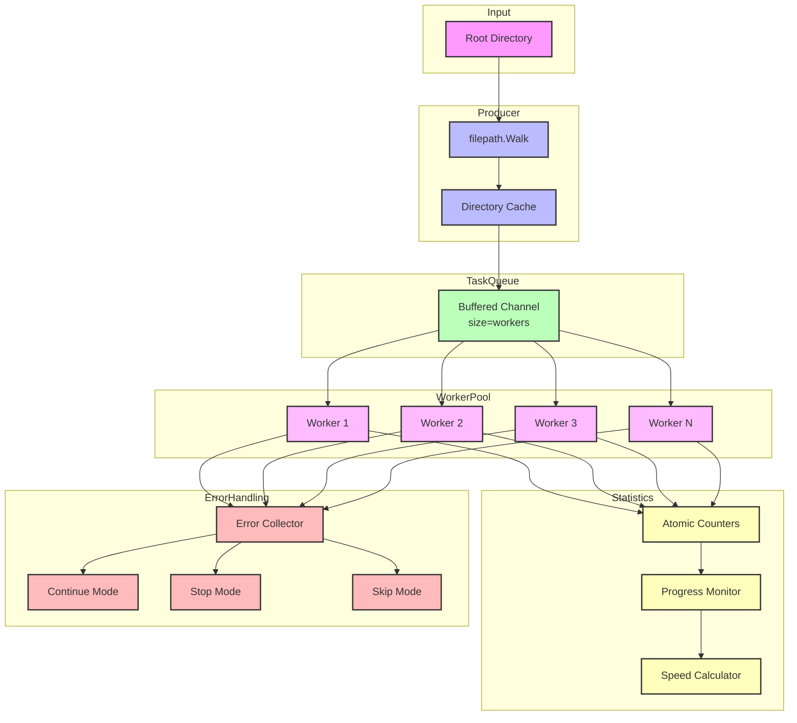

# filewalker

A high-performance concurrent filesystem traversal library with filtering, progress monitoring, and CLI support.

## 🚀 Features

- Concurrency: Parallel traversal for massive speed improvements over filepath.Walk.
- Real-Time Progress: Live tracking of processed files, directories, and throughput.
- Filtering: Control file selection based on size, modification time, patterns, and more.
- Error Handling: Configurable behavior for skipping, continuing, or stopping on errors.
- Symlink Handling: Options to follow, ignore, or report symbolic links.
- Logging: Structured logging via zap with adjustable verbosity.

### ⚠️ **Robust Error Handling**

| Mode    | Behavior |
|---------|--------------------------------------|
| **Continue** | Skip errors, process remaining files. |
| **Stop**     | Halt immediately on first error. |
| **Skip**     | Ignore problematic files & directories. |

Errors are collected using `errors.Join()`, allowing detailed reporting.

### 🔗 **Safe Symlink Handling**

- **Cycle detection** prevents infinite loops
- Configurable: `Follow`, `Ignore`, or `Report`
- **Thread-safe caching** of visited symlinks

### 📝 **Configurable Logging**

- Multiple log levels: **ERROR, WARN, INFO, DEBUG**
- Structured logging with **zap**
- Custom logger support

---

## 📈 Performance

>Benchmarks run on Apple M2 Pro with Go 1.24.

Filewalker significantly outperforms `filepath.Walk` by using concurrent workers:

| Workers | Time (ns/op) | Memory (B/op) | Allocs/op | Speedup |
|---------|-------------|---------------|------------|---------|
| `filepath.Walk` | 2,980,779,125 | 4,217,888 | 26,152 | baseline |
| **2 workers** | 1,436,847,583 | 4,683,048 | 26,213 | 2.07x faster |
| **4 workers** | 722,509,938 | 4,682,936 | 26,208 | 4.13x faster |
| **8 workers** | 360,482,125 | 4,684,189 | 26,210 | 8.27x faster |

### 🛠 **Benchmark Analysis**

- **Speed**: Up to 8.27x faster with 8 workers
- **Memory**: Consistent ~4.6MB memory usage across worker counts
- **Allocations**: Minimal overhead (~60 extra allocs) vs standard library
- **Scaling**: Near-linear performance scaling with worker count

### 🛠 **Benchmark Setup**

- **System**: Apple M2 Pro  
- **Test Data**: Directory depth = 5, 20 files per directory  
- **Measurement**: Processing time per file, converted to MB/s  

---

## 🏗 Architecture

### Performance Design

Filewalker achieves high performance through several key architectural decisions.

### 📊 Architecture Diagram



#### 1. Worker Pool Model

```bash
[Directory Tree] → [Task Queue] → [Worker Pool (N workers)] → [Results]
      ↑                 ↑                 ↑
   Producer       Buffered Channel    Concurrent
    (Walk)        (Size = limit)      Processing
```

- **Producer**: A single goroutine recursively walks the directory tree and pushes tasks into the queue.
- **Task Queue**: A buffered channel efficiently controls memory usage and prevents overload.
- **Worker Pool**: N concurrent workers fetch tasks from the queue for parallel processing.
- **Load Balancing**: Dynamic work stealing ensures an even distribution of file-processing tasks.

#### 2. Memory Optimizations

- **Atomic Operations**: Lock-free statistics tracking for performance.
- **Sync.Map Caching**: Thread-safe directory exclusion cache reduces redundant checks.
- **Buffer Control**: Configurable task queue size prevents excessive memory usage.
- **Minimized Allocations**: Reuses walkArgs structs to reduce GC overhead.

#### 3. Concurrency Control

```go
type walkArgs struct {
    path string
    info os.FileInfo
    err  error
}

// Worker Pool Implementation
for i := 0; i < limit; i++ {
    go worker(tasks <-chan walkArgs)
}
```

- Workers efficiently pull tasks from the queue and process files concurrently.
- The number of workers is configurable, scaling with available CPU cores.
- Graceful shutdown ensures clean termination when walking is canceled.

#### 4. Error Management

- **Non-blocking**: Errors don't stop other workers
- **Aggregation**: Combined using errors.Join()
- **Context**: Graceful cancellation support

#### 5. Progress Tracking

```bash
[Workers] → [Atomic Counters] → [Stats Aggregator] → [Progress Callback]
    ↑            ↑                     ↑                    ↑
 Updates    Thread-safe         500ms Intervals      User Interface
```

- Workers update atomic counters in real time.
- A stats aggregator collects periodic updates every 500ms.
- Progress is reported via a customizable callback function.
- Users can monitor:
  - Files Processed
  - Processing Speed (MB/s)
  - Elapsed Time
  - Error Count

## License

MIT License. See the [LICENSE](LICENSE) file for details.

## Author

Built with ❤️ by [TFMV](https://github.com/TFMV)
