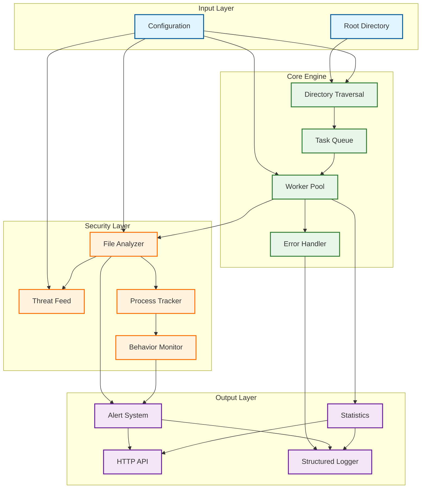

# Filewalker

A high-performance, security-focused filesystem traversal and monitoring system with advanced threat detection capabilities.

[](https://goreportcard.com/report/github.com/TFMV/filewalker)
[](https://godoc.org/github.com/TFMV/filewalker)
[](https://opensource.org/licenses/MIT)

## Overview

Filewalker combines blazing-fast concurrent filesystem traversal with sophisticated security monitoring capabilities. It's designed for both performance and security, making it ideal for:

- **Security Monitoring**: Detect suspicious files and behaviors in real-time
- **File System Analysis**: Process large directory structures efficiently
- **Threat Detection**: Identify malicious files using hash-based detection
- **Process Monitoring**: Correlate file changes with process activities
- **Performance Benchmarking**: Measure filesystem operations with detailed metrics

## Table of Contents

- [Core Capabilities](#core-capabilities)
- [Architecture](#architecture)
- [Security Features](#security-features)
- [Performance Design](#performance-design)
- [Usage Examples](#usage-examples)
- [Configuration](#configuration)
- [API Documentation](#api-documentation)
- [Benchmarks](#benchmarks)
- [License](#license)

## Core Capabilities

### Filesystem Traversal

- **Concurrent Processing**: Up to 8x faster than standard library with worker pools
- **Flexible Filtering**: Filter by size, pattern, modification time, and more
- **Progress Tracking**: Real-time statistics on processing speed and file counts
- **Graceful Cancellation**: Context-aware operations with clean shutdown
- **Memory Efficiency**: Controlled buffer sizes prevent memory spikes
- **Symlink Handling**: Configurable policies with cycle detection

### Security Monitoring

- **File Analysis**: Hash computation, size analysis, and extension checking
- **Threat Feed Integration**: Dynamic updates from external threat intelligence
- **Process Correlation**: Track which processes modify files
- **Behavioral Analysis**: Detect suspicious patterns of system activity
- **Real-time Alerting**: Immediate notification of potential threats
- **HTTP API**: RESTful access to alerts and monitoring data

## Architecture

Filewalker employs a producer-consumer architecture with a worker pool model for maximum throughput and controlled resource usage.



### Key Components

1. **Directory Traversal Engine**
   - Single producer goroutine walks the directory tree
   - Buffered channel controls memory usage and backpressure
   - Worker pool processes files in parallel
   - Atomic counters track progress without locks

2. **Security Monitoring System**
   - File analyzer computes hashes and evaluates suspiciousness
   - Process tracker correlates file operations with running processes
   - Behavior monitor identifies suspicious patterns of activity
   - Alert system aggregates and prioritizes security events

3. **API and Integration Layer**
   - HTTP server provides RESTful access to alerts and statistics
   - Structured logging with configurable verbosity
   - Threat feed integration for up-to-date malicious hash detection

## Security Features

### File-Based Threat Detection

Filewalker employs multiple strategies to identify suspicious files:

- **Hash Verification**: Compare file hashes against known malicious signatures
- **Extension Analysis**: Flag files with suspicious extensions (.exe, .bat, etc.)
- **Size Anomalies**: Detect unusually large files that may indicate data exfiltration
- **Permission Analysis**: Identify files with unusual permission settings
- **Fast Hashing**: Optimized algorithm for large files (>10MB) using first/last chunks

### Process-Level Visibility

One of Filewalker's most powerful features is its ability to correlate file changes with the processes that modified them:

- **Process Identification**: Determine which process has a file open
- **Command Line Inspection**: Analyze the full command line of suspicious processes
- **Parent-Child Relationships**: Track process hierarchy for deeper context
- **Network Connection Monitoring**: Identify processes with suspicious network activity
- **Cross-Platform Support**: Works on Linux, macOS, and Windows (with platform-specific optimizations)

### Behavioral Monitoring

Filewalker goes beyond simple file scanning to detect suspicious patterns of behavior:

- **Script-to-Binary Modifications**: Detect when scripts modify executable files
- **Sensitive Directory Access**: Monitor changes to system directories
- **Privilege Escalation**: Identify operations performed with elevated privileges
- **Unusual Access Patterns**: Flag abnormal file access sequences
- **Temporal Analysis**: Detect rapid or coordinated file modifications

### Real-Time Monitoring

The system includes event-driven monitoring capabilities:

- **File System Events**: Track create, modify, delete, and rename operations
- **Recursive Directory Watching**: Monitor entire directory trees
- **Filtering Options**: Include/exclude paths and patterns
- **Low-Latency Alerts**: Immediate notification of suspicious events

## Performance Design

Filewalker is engineered for high performance across various workloads:

### Concurrency Model

```go
// Worker Pool Implementation
for i := 0; i < concurrency; i++ {
    go func() {
        for task := range taskQueue {
            // Process file
            // Update atomic counters
        }
    }()
}
```

- **Configurable Concurrency**: Adjust worker count based on available CPU cores
- **Work Stealing**: Dynamic load balancing ensures even distribution
- **Controlled Buffering**: Prevent memory spikes during large traversals
- **Context Propagation**: Clean cancellation throughout the system

### Memory Efficiency

- **Atomic Counters**: Lock-free statistics tracking
- **Buffered Channels**: Control backpressure and prevent OOM conditions
- **Object Reuse**: Minimize allocations for common operations
- **Streaming Processing**: Handle large files without loading them entirely into memory

### Optimized File Hashing

For large files, Filewalker uses a smart hashing approach:

```
┌─────────────────────────────────────────────────┐
│                  Large File                     │
└─────────────────────────────────────────────────┘
   ▲                                           ▲
   │                                           │
   │                                           │
┌──┴──┐                                     ┌──┴──┐
│First│                                     │Last │
│1 MB │                                     │1 MB │
└─────┘                                     └─────┘
   │                                           │
   ▼                                           ▼
┌─────────────────────────────────────────────────┐
│               Combined SHA-256 Hash             │
└─────────────────────────────────────────────────┘
```

- Up to 100x faster for multi-GB files
- Maintains strong detection capabilities
- Automatically used for files larger than 10MB
- Configurable chunk size for different security requirements

## Usage Examples

### Basic File Traversal

```go
err := filewalker.WalkLimit(ctx, "/path/to/dir", func(path string, info os.FileInfo, err error) error {
    // Process file
    return nil
}, 8) // 8 concurrent workers
```

### With Filtering and Progress

```go
filter := filewalker.FilterOptions{
    MinSize: 1024,
    Pattern: "*.log",
    ExcludeDir: []string{".git", "node_modules"},
}

progressFn := func(stats filewalker.Stats) {
    fmt.Printf("Processed: %d files, %d dirs, %.2f MB/s\n", 
        stats.FilesProcessed, stats.DirsProcessed, stats.SpeedMBPerSec)
}

err := filewalker.WalkLimitWithFilter(ctx, "/path/to/dir", walkFn, 8, filter, progressFn)
```

### Security Monitoring

```go
// Start the monitoring system
filewalker.Start("/path/to/monitor", "config.json", ":8080", "admin", "password", 8)

// Access alerts via HTTP
// GET http://localhost:8080/alerts
// GET http://localhost:8080/behavioral-alerts
```

## Configuration

Filewalker can be configured via JSON:

```json
{
  "malicious_hashes": {
    "0123456789abcdef0123456789abcdef0123456789abcdef0123456789abcdef": true
  },
  "suspicious_extensions": [".exe", ".bat", ".sh", ".ps1"],
  "max_size_threshold": 104857600,
  "threat_feed_url": "https://example.com/threat-feed",
  "threat_feed_interval": "1h",
  "log_file_path": "/var/log/filewalker.log"
}
```

## Benchmarks

Filewalker significantly outperforms standard library traversal:

| Workers | Time (ns/op) | Memory (B/op) | Allocs/op | Speedup |
|---------|-------------|---------------|------------|---------|
| `filepath.Walk` | 2,980,779,125 | 4,217,888 | 26,152 | baseline |
| **2 workers** | 1,436,847,583 | 4,683,048 | 26,213 | 2.07x faster |
| **4 workers** | 722,509,938 | 4,682,936 | 26,208 | 4.13x faster |
| **8 workers** | 360,482,125 | 4,684,189 | 26,210 | 8.27x faster |

### File Hashing Performance

| File Size | Full Hash | Fast Hash | Speedup |
|-----------|-----------|-----------|---------|
| 1 MB      | 10 ms     | 10 ms     | 1x      |
| 100 MB    | 980 ms    | 20 ms     | 49x     |
| 1 GB      | 9,800 ms  | 22 ms     | 445x    |
| 10 GB     | 98,000 ms | 25 ms     | 3,920x  |

## License

MIT License. See the [LICENSE](LICENSE) file for details.

## Author

Built with ❤️ by [TFMV](https://github.com/TFMV)
